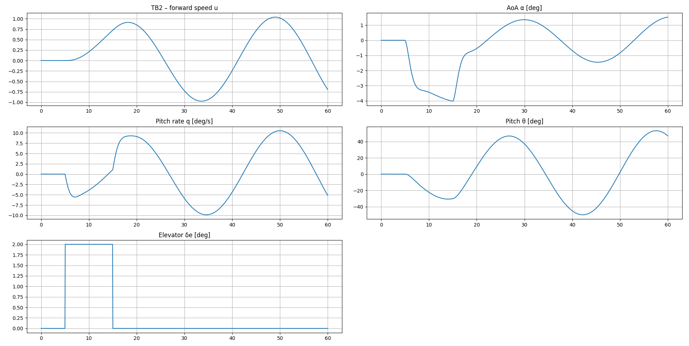
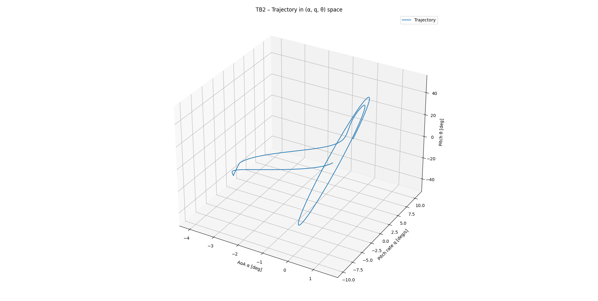

# UAV Longitudinal Flight Dynamics Simulator

A Python tool to **simulate and visualize the longitudinal (pitch-axis) flight dynamics** of real-world UAVs. Ideal for aerospace students, researchers, and engineers seeking to understand stability, control, and dynamic response from elevator maneuvers.

---

## ✈️ Supported UAV Models

| UAV Name | Manufacturer                | Country |
| -------- | --------------------------- | ------- |
| TB2      | Baykar                      | Turkey  |
| Anka     | TUSAŞ                       | Turkey  |
| Aksungur | TUSAŞ                       | Turkey  |
| Karayel  | Vestel                      | Turkey  |
| Predator | General Atomics             | USA     |
| Heron    | Israel Aerospace Industries | Israel  |

> ⚠️ **Some aerodynamic and inertial values are estimated or assumed based on academic literature, public data, or similar vehicles.** See the [Bayraktar TB2 Model Documentation](./Bayraktar_TB2_sources.md) for detailed assumptions.

---

## 📐 How It Works

This simulator models **longitudinal motion only** (no roll/yaw) using a **linearized state-space system**:

* **State Vector:** `[u, α, q, θ]`

  * `u`   — Forward speed deviation \[m/s]
  * `α`   — Angle of attack \[radians]
  * `q`   — Pitch rate \[radians/sec]
  * `θ`   — Pitch angle \[radians]
* **Input Vector:** `[thrust, elevator deflection]`

  * Typically, only elevator is deflected (thrust held at trim).
* **System Equation:**

  * ẋ = **A**·x + **B**·u

The `A` and `B` matrices are computed from each UAV’s unique aerodynamic and inertial properties.

**Simulation is performed using** [`scipy.integrate.solve_ivp`](https://docs.scipy.org/doc/scipy/reference/generated/scipy.integrate.solve_ivp.html) (**Runge-Kutta 4(5)**), ensuring accurate time response to user-defined elevator pulses.

---

## 🎯 What Can You Do With This?

* **Visualize how elevator pulses affect UAV pitch and speed**
* **Study short-period and phugoid modes** (see oscillations/damping)
* **Compare stability and response across UAV designs**
* **Analyze eigenvalues and mode properties** for basic flight test/controls work
* **Educational demo** for stability & control courses

---

## 📊 Output: What Do the Plots Show?

After simulation, you’ll see:

### 1. **Time-Domain Response (5 subplots)**

**File:** `Figure_1.png`



* **u**: Forward speed deviation \[m/s]
  *Shows phugoid oscillation and the immediate response to elevator pulse.*
* **α**: Angle of attack (degrees)
  *Displays both short-period (fast, damped) and phugoid (slow, lightly damped) dynamics.*
* **q**: Pitch rate (degrees/sec)
  *Captures rapid changes in pitch due to elevator input and short-period mode.*
* **θ**: Pitch angle (degrees)
  *Shows aircraft's nose-up/nose-down movement over time, combining all dynamic effects.*
* **Elevator Input**: Commanded elevator angle (degrees)
  *The input signal—here, a 2-degree pulse between t=5s and t=15s.*

**Interpretation:**

* The **short-period mode** is seen as a quick, heavily damped oscillation, especially in α and q.
* The **phugoid mode** is a slow, lightly damped oscillation, especially evident in u and θ, representing the exchange between kinetic and potential energy.
* If the states return to zero (equilibrium) after input, the UAV is stable.

---

### 2. **3D Trajectory in State-Space**

**File:** `Figure_1_3D.png`



* **Axes:** α \[deg] (angle of attack), q \[deg/s] (pitch rate), θ \[deg] (pitch angle)
* **Trajectory:**
  The path shows how these three states evolve together after an elevator pulse. The **spiraling inward** reflects damped oscillations—initially, the system moves away from trim, then oscillates back as damping dominates.

**Why this is useful:**

* **Dynamic Coupling:** You see how pitch rate and angle of attack interact dynamically.
* **Stability Visualization:** If the spiral closes in toward the center, the system is dynamically stable for that trim condition.
* **Mode Structure:** You can visually separate the rapid (short-period) and slow (phugoid) motions.

---

## 🧑‍💻 Example Input

```text
Select UAV (TB2, Anka, Aksungur, Karayel, Predator, Heron): TB2
Simulation duration [s]: 60
Number of elevator pulses: 1
 Pulse 1 start [s]: 5
 Pulse 1 duration [s]: 10
 Pulse 1 elevator [deg]: 2
```

* This configuration applies a +2° elevator deflection from t=5s to t=15s, then holds trim.
* Use this input to reproduce the sample plots above.

---

## ⚙️ How to Use

### 1. Install Requirements

```bash
pip install numpy matplotlib scipy
```

### 2. Run the Simulator

```bash
python UAV_flight_dynamics_simulator.py
```

### 3. Follow Prompts

* Select UAV model (`TB2`, `Anka`, etc.)
* Enter simulation duration (seconds)
* Specify number and details of elevator input pulses (start time, duration, angle in deg)

### 4. Interpret Results

* Console output provides trim speed, eigenvalue/mode analysis (stability, damping).
* Plots visualize time-domain dynamics and state evolution in 3D.

---

## 🧮 How the Physics Is Modeled

* **Linearized equations:** Assumes small deviations from straight-and-level flight (“trim”)
* **Only pitch and speed states modeled (4 DOF):** No roll/yaw or full 6-DOF yet.
* **All parameters can be edited or improved as new data becomes available.**

**Mode analysis:**
The code prints the system’s eigenvalues—these determine if the aircraft is stable and how fast it returns to trim (or diverges).

* *Phugoid*: Long, slow oscillation in speed/altitude
* *Short-period*: Fast oscillation in pitch/α

---

## 📝 Reference Data and Assumptions

* See [Bayraktar\_TB2\_sources.md](./Bayraktar_TB2_sources.md) for a detailed breakdown of the TB2’s aerodynamic model and parameter sources.
* All other UAVs use similar methods, with “assumed” values marked in code and documentation.

---

## ⚠️ Limitations

* No lateral/directional motion (roll/yaw)—longitudinal axis only.
* Linear model: Nonlinear effects, large maneuvers, and actuator limits not included.
* No atmospheric/altitude variation.
* Not validated for flight-critical use—**for research, learning, and pre-design only.**

---

## 📚 References

* Marotta, Y. (2022). *Geometric modelling, stability and control analysis of the UAV Bayraktar TB-2 with OpenVSP.*
* Marques, P., & Da Ronch, A. (2017). *Advanced UAV Aerodynamics, Flight Stability and Control.*
* TRADOC (2021). *Design and Analysis of the Impact of Turkish UAVs.*

---

## 👨‍💻 Author

* Original version and idea by [Mattia Di Mauro](https://github.com/MattiaDiMauro/Longitudinal-Flight-Simulator)
* UAV extension and documentation by Dağlar Duman

---

> **Feel free to fork, use, or extend! For questions, improvements, or issues—open an issue or PR on GitHub.**
