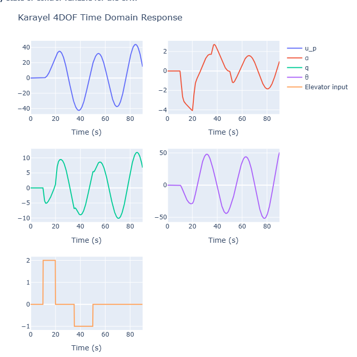
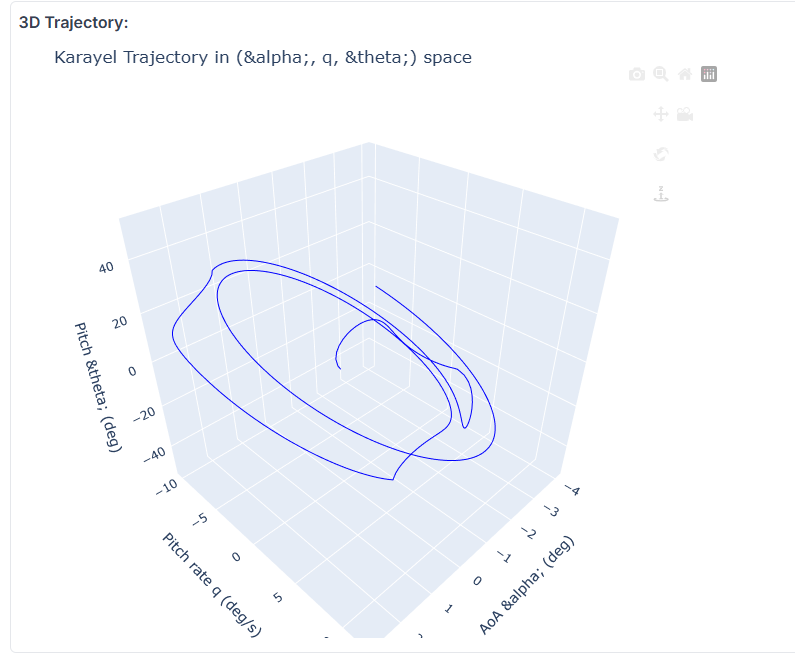
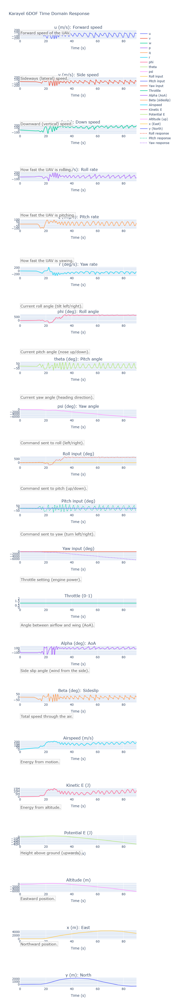
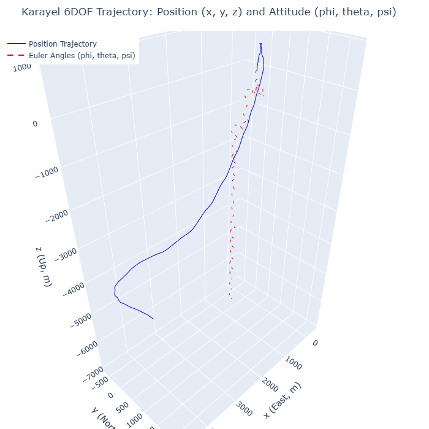

# UAV Flight Dynamics Simulator

A comprehensive web-based application for simulating and analyzing the flight dynamics of fixed-wing UAVs. This tool allows aerospace engineers, researchers, and students to study how control inputs affect UAV dynamic behavior through an intuitive interface.


## 🌟 Key Features

- **Dual Simulation Modes**: Supports both 4DOF (longitudinal) and 6DOF (full motion) simulation
- **Interactive UI**: Built with Reflex and Plotly for a responsive, dynamic experience
- **Real-time Visualization**: Comprehensive plotting of all state variables and control responses
- **Stability Analysis**: Eigenvalue analysis with mode identification and stability assessment
- **Customizable UAV Parameters**: Edit and save aircraft parameters for different vehicles
- **Multiple Control Inputs**: Define pulse inputs for elevator, aileron, rudder, and throttle

## ✈️ Supported UAV Models

| UAV Name   | Manufacturer                | Country |
| ---------- | --------------------------- | ------- |
| TB2        | Baykar                      | Turkey  |
| Anka       | TUSAŞ                       | Turkey  |
| Aksungur   | TUSAŞ                       | Turkey  |
| Karayel    | Vestel                      | Turkey  |
| Predator   | General Atomics             | USA     |
| Heron MK1  | Israel Aerospace Industries | Israel  |
| Heron MK2  | Israel Aerospace Industries | Israel  |

> ⚠️ **Some aerodynamic and inertial values are estimated or assumed based on academic literature, public data, or similar vehicles.** Lateral-directional derivatives for 6DOF simulation are particularly subject to estimation.

## 📐 Simulation Theory & Implementation

### 4DOF Simulation (Longitudinal Motion)

The 4DOF simulator models longitudinal motion using a linearized state-space system:

* **State Vector:** `[u, α, q, θ]`  
   * `u` — Forward speed deviation [m/s]  
   * `α` — Angle of attack [radians]  
   * `q` — Pitch rate [radians/sec]  
   * `θ` — Pitch angle [radians]
* **Input Vector:** `[thrust, elevator deflection]`  
* **System Equation:** ẋ = **A**·x + **B**·u

The A and B matrices are computed from aerodynamic and inertial properties, including:
- Mass, wing area, and chord length
- Lift and drag coefficients (CL, CD)
- Moment coefficients (Cm)
- Forward speed dependencies (CL_u, CD_u, Cm_u)

### 6DOF Simulation (Full Motion)

The 6DOF simulator implements full aircraft dynamics with:

* **State Vector:** `[u, v, w, p, q, r, φ, θ, ψ, x, y, z]`
   * `u, v, w` — Body-axis velocities [m/s]
   * `p, q, r` — Body-axis angular rates [rad/s]
   * `φ, θ, ψ` — Euler angles (roll, pitch, yaw) [rad]
   * `x, y, z` — NED position coordinates [m]
* **Input Vector:** `[roll, pitch, yaw, throttle]`
* **Additional Parameters Required:**
   * Moments of inertia (Ixx, Iyy, Izz, Ixz)
   * Lateral-directional derivatives (CYb, Clp, Cnr, etc.)
   * Control derivatives for all surfaces

Implementation details:
- Non-linear 6DOF equations of motion
- Inertial coupling through the full inertia tensor
- Position integration in North-East-Down (NED) reference frame
- Rotation matrix transformations between body and inertial frames

Both simulations use scipy.integrate.solve_ivp with Runge-Kutta 4(5) integration for accurate time-domain response.

## 🎮 Control Input System

The simulator supports defining multiple pulse inputs:

### 4DOF Mode
- **Elevator pulses**: Control the pitch motion
- Configure start time, duration, and deflection angle (degrees)

### 6DOF Mode
- **Roll control**: Aileron/roll input (degrees)
- **Pitch control**: Elevator/pitch input (degrees)
- **Yaw control**: Rudder/yaw input (degrees)
- **Throttle control**: Engine power setting (0-1)
- All inputs can be configured with start time and duration

The control input system handles multiple overlapping pulses, calculating the combined effect at each time step during simulation.

## 🎯 User Interface Components

### UAV Parameter Editor
- Select from predefined UAV models
- View/edit all physical and aerodynamic parameters
- Different parameters displayed based on simulation mode
- Save modified parameters for future use

### Pulse Editor
- Add, remove, and configure control pulses
- Adaptive interface changes based on simulation mode
- Real-time validation of input values

### Simulation Controls
- Switch between 4DOF and 6DOF simulation modes
- Set simulation duration
- Run simulation with current parameters
- Reset to saved configuration

### Results Display
- Trim speed calculation and display
- Eigenvalue analysis with mode identification
- Time-domain response plots
- 3D trajectory visualization
- Summary of simulation inputs

## 📊 Output Visualization

### 4DOF Simulation Results

After a 4DOF simulation using the TB2 UAV model, you will see the following results and visualizations:

*UAV Model Used: Karayel*

**Input Configuration:**
```markdown
Simulation Duration: 90 seconds

Elevator Pulses:
- Start: 10s, Duration: 10s, Angle: 2°
- Start: 35s, Duration: 15s, Angle: -1°
```

**Results Summary:**
```markdown
Trim Speed: U0 = 37.43 m/s (72.76 knots)

Eigenvalue Analysis:
- Short Period Mode: lambda = -0.9866+0.8354j | wn = 1.2928 rad/s | zeta = 0.763
  --> Highly damped (probably not oscillatory)
- Phugoid Mode: lambda = 0.0105+0.2110j | wn = 0.2112 rad/s | zeta = -0.050
  --> UNSTABLE (Danger: positive real part!)
```

**Interpretation of 4DOF Outputs:**

The 4DOF simulation models the aircraft\'s longitudinal motion using a linearized state-space system. The results are primarily presented as time-domain responses of the key state variables and the control input. These plots show how the aircraft\'s states evolve over time based on the integrated linearized equations of motion (ẋ = A·x + B·u), where **x** is the state vector `[u_p, α, q, θ]` and **u** is the input vector `[thrust, elevator]`. For the examples provided (using elevator pulses only), the thrust input component is considered zero.

**1. Time-Domain Response Plots**

These plots display the changes in the four state variables and the elevator input over the simulation duration:

*   **u_p (m/s): Forward speed perturbation**: This variable represents the deviation of the aircraft\'s forward speed from the initial trim speed (U0). It is the first element of the state vector, \(x_0\). The rate of change of \(u_p\), denoted as \(\dot{u}_p\), is calculated from the first row of the state-space equation:
    \[ \dot{u}_p = A_{11}u_p + A_{12}\alpha + A_{13}q + A_{14}\theta + B_{11}thrust + B_{12}elevator \]
    The plot shows \(u_p(t) = x_0(t) \cdot U0\), representing the actual change in speed from the trim value in meters per second.

*   **α (deg): Angle of attack**: The angle of attack is the angle between the aircraft\'s longitudinal axis and the direction of the airflow, projected onto the aircraft\'s vertical (x-z) plane. It is the second element of the state vector, \(x_1\). Its rate of change, \(\dot{\alpha}\), is computed from the second row of the state-space equation:
    \[ \dot{\alpha} = A_{21}u_p + A_{22}\alpha + A_{23}q + A_{24}\theta + B_{21}thrust + B_{22}elevator \]
    The plot shows the integrated angle of attack values, converted from radians to degrees.

*   **q (deg/s): Pitch rate**: The pitch rate is the angular velocity of the aircraft about its lateral (pitch) axis (body y-axis). It is the third element of the state vector, \(x_2\). Its rate of change, \(\dot{q}\), is calculated from the third row of the state-space equation:
    \[ \dot{q} = A_{31}u_p + A_{32}\alpha + A_{33}q + A_{34}\theta + B_{31}thrust + B_{32}elevator \]
    The plot displays the integrated pitch rate values, converted from radians per second to degrees per second.

*   **θ (deg): Pitch angle**: The pitch angle is the angle between the aircraft\'s longitudinal axis and the horizontal plane. It is the fourth element of the state vector, \(x_3\). In the linearized small-perturbation model, the rate of change of the pitch angle, \(\dot{\theta}\), is directly equal to the pitch rate, \(q\):
    \[ \dot{\theta} = q \]
    The plot shows the integrated pitch angle values, representing the change from the trim pitch angle, converted from radians to degrees.

*   **Elevator (deg): Input**: This plot shows the time history of the commanded elevator deflection. This is the primary control input (\(u_1\)) used to influence the longitudinal dynamics in this simulation mode. Its values are directly taken from the user-defined pulse configuration and are plotted in degrees.



**Interpretation of 4DOF Example Results:**

For the given elevator pulse inputs on the TB2 UAV, the simulation results show:
- **Short Period Mode**: The eigenvalue analysis indicates a highly damped short period mode (ζ = 0.763). This is reflected in the time domain plots by the quick damping of initial oscillations in angle of attack (α) and pitch rate (q) following the elevator inputs. This suggests good handling qualities for rapid pitch maneuvers.
- **Phugoid Mode**: The analysis reveals an unstable phugoid mode (ζ = -0.050). This positive real part of the eigenvalue means that oscillations in speed (u_p) and pitch angle (θ) will gradually grow in amplitude over time if not actively controlled. The time domain plots visually confirm this, showing oscillations in \(u_p\) and θ that increase in magnitude throughout the 90-second simulation.
- **Overall Response**: The initial 2° elevator pulse at 10s causes a noticeable pitch-up (increase in θ) and angle of attack (α), with associated changes in pitch rate (q) and forward speed perturbation (u_p). The subsequent -1° pulse at 35s initiates a pitch-down response. The unstable phugoid is evident in the long-term divergent behavior of the speed and pitch angle.

**2. 3D Trajectory Plot**

This plot visualizes the aircraft\'s dynamic motion in a 3D state-space defined by three key longitudinal variables: Angle of Attack (α), Pitch Rate (q), and Pitch Angle (θ). Each point on the blue trajectory line represents the simultaneous values of `[α, q, θ]` at a specific moment in time during the simulation. The trajectory starts near the origin (representing the initial trim state of zero perturbations) and traces the path of the aircraft\'s attitude and pitch rate through this state space as it responds to control inputs and its inherent dynamics. The shape of the trajectory provides a qualitative understanding of the coupling between these states and the damping/stability of the longitudinal modes.

*   **Axes:** α [deg] (angle of attack), q [deg/s] (pitch rate), θ [deg] (pitch angle). These axes directly correspond to the \(x_1\), \(x_2\), and \(x_3\) components of the integrated state vector from the simulation, with values converted to degrees for visualization.
*   **Trajectory:** The blue line plots the points \((\alpha(t), q(t), \theta(t))\) derived from the simulation\'s output state matrix (`y_vals[1]`, `y_vals[2]`, `y_vals[3]`) over time. For a stable system, this trajectory would spiral inward towards the origin; the outward spiraling or diverging path seen for this unstable phugoid example confirms the instability identified in the eigenvalue analysis.



### 6DOF Simulation Results

After 6DOF simulation, the visualization includes:

**1. Comprehensive Time-Domain Response**
* **Velocities**: u, v, w (body-axis velocities)
* **Angular Rates**: p, q, r (roll, pitch, yaw rates)
* **Attitude**: φ, θ, ψ (roll, pitch, yaw angles)
* **Control Inputs**: Roll, pitch, yaw inputs and throttle
* **Derived Values**: 
  * Angle of attack (α) and sideslip (β)
  * Airspeed
  * Energy components (kinetic, potential)
  * Position (x, y, z in NED frame)



**2. 3D Trajectory Visualization**
* Position trajectory (x, y, z)
* Euler angle trajectory (φ, θ, ψ)
* Shows the complete spatial motion of the UAV



Each plot includes clear explanations of what the variable represents, making the results accessible to users with different levels of aerospace knowledge.

## 💡 Stability Analysis

The eigenvalue analysis provides insights into the dynamic stability of the aircraft:

### 4DOF Mode Analysis
1. **Short Period Mode**:
   * Higher frequency oscillations (typically >0.5 rad/s)
   * Involves primarily angle of attack and pitch rate
   * Critical for handling qualities

2. **Phugoid Mode**:
   * Lower frequency oscillations (typically <0.5 rad/s)
   * Involves primarily speed and pitch angle
   * Represents exchange between kinetic and potential energy

3. **Subsidence Modes** (if present):
   * Non-oscillatory decay or growth
   * Can be associated with speed or height subsidence

### Stability Assessment
The application automatically evaluates stability through the damping ratio (ζ) of each mode:
* ζ < 0: Unstable (positive real part)
* 0 < ζ < 0.02: Very poorly damped
* 0.02 < ζ < 0.2: Poorly damped
* 0.2 < ζ < 0.7: Good aircraft response
* ζ > 0.7: Heavily damped (potentially non-oscillatory)

## 📋 Example Simulation Results

### 4DOF Example

**Input Configuration:**
```markdown
Simulation Duration: 90 seconds

Elevator Pulses:
- Start: 10s, Duration: 10s, Angle: 2°
- Start: 35s, Duration: 15s, Angle: -1°
```

**Results Summary:**
```markdown
Trim Speed: U0 = 37.43 m/s (72.76 knots)

Eigenvalue Analysis:
- Short Period Mode: lambda = -0.9866+0.8354j | wn = 1.2928 rad/s | zeta = 0.763
  --> Highly damped (probably not oscillatory)
- Phugoid Mode: lambda = 0.0105+0.2110j | wn = 0.2112 rad/s | zeta = -0.050
  --> UNSTABLE (Danger: positive real part!)
```

**Interpretation:**
- The short period mode is well-damped, indicating good handling qualities for quick maneuvers
- The phugoid mode shows slight instability (positive real part), which means the aircraft will gradually diverge from equilibrium in speed and pitch over long periods
- The time domain response shows an initial pitch-up response to the 2° elevator input, followed by an oscillatory motion that gradually increases in amplitude due to the unstable phugoid

### 6DOF Example

*UAV Model Used: Karayel*

**Input Configuration:**
```markdown
Simulation Duration: 90 seconds

Control Pulses:
- Start: 10s, Duration: 10s, Roll: 2°, Pitch: 2°, Yaw: -3°, Throttle: 1
- Start: 30s, Duration: 15s, Roll: -1°, Pitch: -1°, Yaw: 0°, Throttle: 1
- Start: 60s, Duration: 10s, Roll: 0°, Pitch: 0°, Yaw: 2°, Throttle: 1
```

**Results Summary:**
```markdown
Trim Speed: U0 = 37.43 m/s (72.76 knots)

Eigenvalue Analysis:
6DOF simulation: Eigen analysis not implemented.
```

**Interpretation of 6DOF Outputs:**

The 6DOF simulation provides a comprehensive view of the aircraft\'s full motion. The outputs include body-axis velocities and angular rates, Euler angles, derived aerodynamic angles (AoA, sideslip), airspeed, energy states, and inertial position.

- **The Time Domain Response plots** show 21 different variables over time:

  - **u (m/s): Forward speed**: The velocity component along the body\'s x-axis. Calculated from the integration of the x-axis equation of motion, which includes aerodynamic forces (like drag), thrust (from throttle), and rotational coupling terms (r*v - q*w).

  - **v (m/s): Side speed**: The velocity component along the body\'s y-axis. Calculated from the integration of the y-axis equation of motion, influenced by side force (related to sideslip and control surface deflection) and rotational coupling (p*w - r*u).

  - **w (m/s): Down speed**: The velocity component along the body\'s z-axis. Calculated from the integration of the z-axis equation of motion, affected by normal force (lift), gravity, and rotational coupling (q*u - p*v).

  - **p (deg/s): Roll rate**: The angular velocity around the body\'s x-axis. Calculated from the integration of the roll moment equation, which depends on roll moment (L), moments of inertia (Ixx, Izz, Ixz), and products of inertia and angular rates.

  - **q (deg/s): Pitch rate**: The angular velocity around the body\'s y-axis. Calculated from the integration of the pitch moment equation, primarily driven by the pitching moment (M) and the pitch moment of inertia (Iyy).

  - **r (deg/s): Yaw rate**: The angular velocity around the body\'s z-axis. Calculated from the integration of the yaw moment equation, influenced by yaw moment (N), moments of inertia, and products of inertia and angular rates.

  - **phi (deg): Roll angle**: The Euler angle representing rotation around the inertial x-axis (roll). Calculated by integrating the kinematic equation relating Euler angle rates to body angular rates (p, q, r) and other Euler angles (theta, psi).

  - **theta (deg): Pitch angle**: The Euler angle representing rotation around the inertial y-axis (pitch). Calculated by integrating the kinematic equation involving body angular rates (q, r) and roll angle (phi).

  - **psi (deg): Yaw angle**: The Euler angle representing rotation around the inertial z-axis (yaw). Calculated by integrating the kinematic equation involving body angular rates (q, r) and Euler angles (phi, theta).

  - **Roll input (deg)**: The commanded roll control surface deflection (aileron) or equivalent input signal. This is an input to the simulation, defined by the user\'s pulse configuration.

  - **Pitch input (deg)**: The commanded pitch control surface deflection (elevator) or equivalent input signal. This is an input to the simulation, defined by the user\'s pulse configuration.

  - **Yaw input (deg)**: The commanded yaw control surface deflection (rudder) or equivalent input signal. This is an input to the simulation, defined by the user\'s pulse configuration.

  - **Throttle (0-1)**: The commanded throttle setting (0 for idle, 1 for max thrust). This is an input to the simulation, defined by the user\'s pulse configuration.

  - **Alpha (deg): AoA**: Angle of Attack, the angle between the body\'s x-axis and the velocity vector in the body\'s x-z plane. Calculated from body-axis velocities: α = arctan2(w, u).

  - **Beta (deg): Sideslip**: The angle between the velocity vector and the body\'s x-axis in the body\'s x-y plane. Calculated from body-axis velocities and airspeed: β = arcsin(v / Airspeed).

  - **Airspeed (m/s)**: The magnitude of the velocity vector in the body frame. Calculated as the square root of the sum of the squares of the body-axis velocities: Airspeed = sqrt(u² + v² + w²).

  - **Kinetic E (J)**: Kinetic energy of the aircraft. Calculated as 0.5 * mass * Airspeed².

  - **Potential E (J)**: Potential energy of the aircraft relative to a reference (sea level). Calculated as mass * gravity * (-z), where z is the downward position (so -z is altitude).

  - **Altitude (m)**: The height of the aircraft above the reference plane. In the NED frame, this is simply the negative of the z position: Altitude = -z.

  - **x (m): East**: The position coordinate in the East direction in the North-East-Down (NED) inertial frame. Calculated by integrating the Eastward velocity component, which is derived from the body-axis velocities rotated to the inertial frame using the Euler angles (phi, theta, psi).

  - **y (m): North**: The position coordinate in the North direction in the NED inertial frame. Calculated by integrating the Northward velocity component, derived from body-axis velocities and Euler angles.

  - **z (m): Down**: The position coordinate in the Down direction in the NED inertial frame. Calculated by integrating the Downward velocity component, derived from body-axis velocities and Euler angles.

  Each plot shows how these variables change over the simulation duration. The overlaid dotted lines on the input plots (Roll, Pitch, Yaw) represent the corresponding body-axis angle responses (phi, theta, psi) for easy comparison of command vs. result.

- **The 3D Trajectory plot** shows two important aspects:
  - The blue line shows the physical path of the aircraft through space (x, y, z coordinates in the NED frame). It visually represents the aircraft\'s movement over the ground.
  - The red dashed line shows how the attitude (roll, pitch, yaw angles - phi, theta, psi) changes over time. This helps understand the aircraft\'s orientation during the flight path.

  This visualization helps understand how control inputs affect both the aircraft\'s position and its orientation in 3D space, capturing the coupled nature of 6DOF flight.

The 6DOF simulation provides a much more complete picture of aircraft behavior than the 4DOF model, capturing cross-coupling effects between longitudinal and lateral-directional dynamics.

## ⚙️ Technical Implementation

### Architecture
- **UI Framework**: Reflex for reactive web components
- **State Management**: Centralized FlightSimState class handling all simulation logic
- **Rendering**: Plotly for interactive plots with subplot capabilities
- **Mathematical Core**: NumPy for matrix operations, SciPy for ODE integration

### Key Implementation Features
- **Dynamic UI**: UI components adapt to the selected simulation mode
- **Error Handling**: Input validation with visual feedback
- **Asynchronous Processing**: Simulation runs in the background to prevent UI freezing
- **Responsive Layout**: Adapts to different screen sizes with Tailwind CSS
- **Plot Customization**: Comprehensive labels, legends, and visual styling

## 🚀 Installation & Usage

### Prerequisites
* Python 3.8 or higher
* Required Python packages:
```markdown
reflex>=0.7.8
numpy
scipy
plotly
```

### Installation

1. Clone the repository:
```bash
git clone https://github.com/daglar510/UAV_flight_dynamics_simulator.git
cd UAV_flight_dynamics_simulator
```

2. Install dependencies:
```bash
pip install -r requirements.txt
```

3. Run the application:
```bash
python -m reflex run
```

4. Open your browser and navigate to http://localhost:3000

### FlightGear Integration Setup

1. Install FlightGear:
   - Windows: Download from flightgear.org
   - Linux: `sudo apt-get install flightgear`

2. Install additional Python package:
   ```bash
   pip install python-flightgear
   ```

3. Configure FlightGear:
   - Copy UAV model to FlightGear aircraft directory
   - Launch simulator with FlightGear visualization mode
   - Use provided launch script if needed

### Typical Workflow

1. **Select a UAV** from the dropdown menu
2. **Choose simulation mode** (4DOF or 6DOF)
3. **Adjust UAV parameters** if needed
4. **Set up control pulses**:
   - For 4DOF: Define elevator pulses
   - For 6DOF: Define roll, pitch, yaw, and throttle pulses
5. **Set simulation duration**
6. **Run the simulation**
7. **Analyze results** in the visualization section

## ⚠️ Limitations

* **Linear Assumptions**: 4DOF mode uses linearized aerodynamics
* **Parameter Estimation**: Some UAV parameters are estimated from limited public data
* **Environmental Effects**: No wind, turbulence, or atmospheric variation models
* **Computational Efficiency**: Complex simulations may be slower in the web environment
* **Not Flight-Certified**: For educational and pre-design purposes only

## 🧪 Internal Code Structure

The application consists of the following major components:

```
flight_dynamics_simulator_ui_design/
├── components/                     # UI components
│   ├── pulse_editor.py            # Control pulse definition interface
│   ├── results_display.py         # Visualization of simulation results
│   ├── simulation_controls.py     # Mode selection and run controls
│   └── uav_editor.py              # UAV parameter editing interface
├── states/
│   └── flight_sim_state.py        # Core simulation logic and state management
└── utils/
    ├── constants.py               # Physical constants
    ├── types.py                   # Type definitions for UAV parameters
    └── uav_models.py              # Pre-defined UAV models database
```

### Key Technical Functions

- **_build_state_space**: Constructs the A and B matrices for 4DOF simulation
- **_build_state_space_6dof**: Prepares parameters for 6DOF simulation
- **_simulate_response**: Performs integration for 4DOF dynamics
- **_simulate_response_6dof**: Performs integration for 6DOF dynamics
- **_analyze_modes**: Computes and categorizes eigenvalues
- **_create_time_domain_plot**: Generates visualization for 4DOF results
- **_create_time_domain_plot_6dof**: Generates visualization for 6DOF results

## 📚 References

* Marotta, Y. (2022). _Geometric modelling, stability and control analysis of the UAV Bayraktar TB-2 with OpenVSP._
* Marques, P., & Da Ronch, A. (2017). _Advanced UAV Aerodynamics, Flight Stability and Control._
* TRADOC (2021). _Design and Analysis of the Impact of Turkish UAVs._
* Stevens, B.L., Lewis, F.L., & Johnson, E.N. (2015). _Aircraft Control and Simulation: Dynamics, Controls Design, and Autonomous Systems._
* Cook, M.V. (2012). _Flight Dynamics Principles: A Linear Systems Approach to Aircraft Stability and Control._

## 👨‍💻 Author & Contributing

* Original version and idea by Mattia Di Mauro
* UAV extension and documentation by Dağlar Duman
* UI development by Dağlar Duman
* 6DOF implementation by Dağlar Duman

Contributions to improve the Flight Dynamics Simulator are welcome! Please feel free to submit a pull request or open an issue to discuss potential improvements.

## 📄 License

This project is licensed under the MIT License - see the LICENSE file for details.

---

> **Feel free to fork, use, or extend! For questions, improvements, or issues—open an issue or PR on GitHub.**

- **If you want to reach out**: [Email](mailto:daglarduman510@gmail.com)
- **GitHub Repository**: [UAV_flight_dynamics_simulator](https://github.com/daglar510/UAV_flight_dynamics_simulator)
